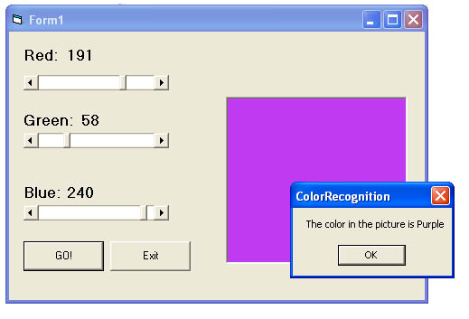



## Color Recognition

### Description

This snippet of code will change the background

color of a picture box to reflect the value of the Red, Green and Blue scroll bars and indicate in a message box what the color it is: A shade of blue, purple, orange etc...
 
### More Info
 
This code is still in its infancy so it's unable to determine if a color is brown or tan just yet.

             |
---                |---
**Submitted On**   |2004-06-12 16:18:00
**By**             |[Jennifer MacDonald](https://github.com/Planet-Source-Code/PSCIndex/blob/master/ByAuthor/jennifer-macdonald.md)
**Level**          |Intermediate
**User Rating**    |4.1 (29 globes from 7 users)
**Compatibility**  |VB 6\.0
**Category**       |[Graphics](https://github.com/Planet-Source-Code/PSCIndex/blob/master/ByCategory/graphics__1-46.md)
**World**          |[Visual Basic](https://github.com/Planet-Source-Code/PSCIndex/blob/master/ByWorld/visual-basic.md)
**Archive File**   |[Color\_Reco1756786122004\.zip](https://github.com/Planet-Source-Code/jennifer-macdonald-color-recognition__1-54354/archive/master.zip)

